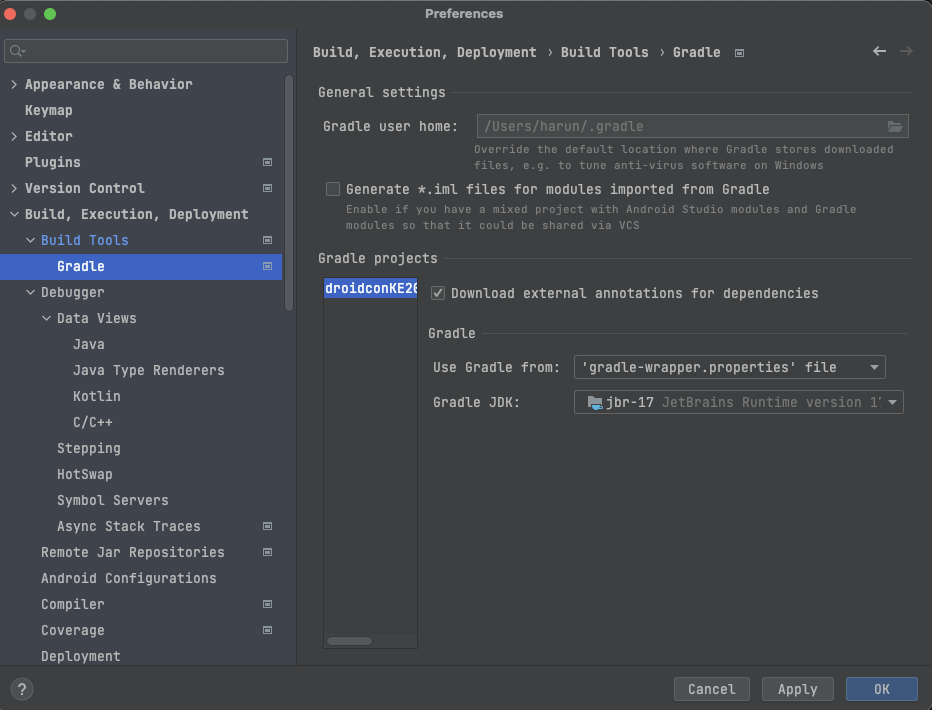

# droidcon KE 23 🔥🔨

Android app for the 4th Android Developer conference- Droidcon Kenya to be held in Nairobi on 8th - 10th
November.

This project is the Android app for the conference. The app supports devices running Android 5.0+,
and is optimized for phones and tablets of all shapes and sizes.

## Running the Project

To ensure the project runs on your local environment ensure you have Java 17 on your PC or if you
don't have you can install it
from [here](https://www.oracle.com/java/technologies/javase/jdk17-archive-downloads.html).

If you have multiple installations of Java make sure to set Java 17 as your preferred version to run
the project.

With the new Android Gradle Plugin version 8.0.0, you need Java 17 to run the project and any
terminal commands. A workaround for this is to add this in your **global** gradle.properties file:

```properties
org.gradle.java.home=/Applications/Android Studio.app/Contents/jbr/Contents/Home
```

This simply sets the Gradle Java home to the one set in Android Studio. Android Studio
Flamingo comes bundled with Java 17. You only need to ensure the project uses Java 17. To do so,
go to **File -> Project Structure -> SDK Location -> Gradle Settings** and set the Java Version to
17 from the list that appears.



## Dependencies

1. Jetpack Compose
2. Coroutines - For Concurrency and Asynchronous tasks
3. Ktor - For network requests
4. Hilt - For Dependency Injection
5. Crashlytics
6. Coil - For Image Loading and Caching
7. Lint Checks - [Ktlint](https://ktlint.github.io/)

## Architecture

The proposed architecture is as follows;

### Data

This layer will include;

1. Network Calls
2. Caching
3. Storing and fetching Preferences.
4. The repository implementation
5. The relevant data models
6. Relevant Mappers

### Domain

This layer will contain;

1. The repository
2. The relevant domain models.

### Presentation

1. View
2. ViewModels
3. Relevant Mappers
4. Relevant Models.

## Features

The app will have the following features:

- Sessions
- Feed
- About
- Home
- Speakers
- Sponsors
- Authentication
- Feedback

## Designs

This is the link to the app designs:  
[Light Theme] (https://xd.adobe.com/view/dd5d0245-b92b-4678-9d4a-48b3a6f48191-880e/)  
[Dark Theme] (https://xd.adobe.com/view/5ec235b6-c3c6-49a9-b783-1f1303deb1a8-0b91/)

The app uses a design system: Chai

## Dependencies

The project
uses [Versions Catalog](https://docs.gradle.org/current/userguide/platforms.html#sub:version-catalog)
to set up and share dependencies across the modules. The main reasons for choosing to adopt Versions
Catalog are:

- Central place to define dependencies.
- Easy syntax.
- Does not compromise on build speeds as changes do not need the module to be compiled.

To add a dependency, navigate to **gradle/libs.versions.toml*** file, which has all the dependencies
for the whole project. This file has the following sections:

[versions] is used to declare the version numbers that will be referenced later by plugins and
libraries.
[libraries] Define the libraries that will be later accessed in our Gradle files.
[bundles] Are used to define a set of dependencies. For this, we have `compose`, `room`, `lifecycle`
and `ktor` as examples.
[plugins] Used to define plugins.

You need to add your dependency version in [versions]. This is unnecessary if you are not sharing
the version across different dependencies. After defining the version, add your library in
the [libraries] section as:

```toml
compose-activity = "androidx.activity:activity-compose:1.5.0"
```

Moreover, if you have already defined the version in [versions], you define it as:

```toml
androidx-splashscreen = { module = "androidx.core:core-splashscreen", version.ref = "splash" }
```

**Note**:

- You can use separators such as -, _v, . that will be normalized by Gradle to . in the Catalog and
  allow you to create subsections.
- Define variables using **CamelCase**.\
- Check if the library can be added to any existing bundles.

## Compose Preview and ViewModel

Previews are limited when using ViewModel within a composable.

If you want to preview a composable that uses a ViewModel, you should create another composable with
the parameters from ViewModel passed as arguments of the composable. This way, you don't need to
preview the composable that uses the ViewModel.

More on Previews and ViewModels can be
found [here](https://developer.android.com/jetpack/compose/tooling/previews#preview-viewmodel).

## Compatibility

This project uses `coreLibraryDesugaring` to support newer Java 8 APIs that are not available on API
levels 25 and below. Specifically the Kotlin `kotlinx.datetime` API which depends on
Java's `java.time`.
This allows use of `kotlinx.datetime.LocalDate` without having to wrap it
in `@RequiresAPI(Build.VERSION_CODES.O)` and also backports the fix to API level 21.
More on Desugaring using Android Gradle Plugin can be
found [here](https://developer.android.com/studio/write/java8-support).
Instructions on how to set up and add `coreLibraryDesugaring` to your project can be
found [here](https://developer.android.com/studio/write/java8-support#library-desugaring).

## Contributing

Contributions are always welcome!

See [`CONTRIBUTING.md`](CONTRIBUTING.md) for ways to get started.

## Contributors

We would endlessly like to thank the following contributors

<!-- readme: contributors -start -->
<table>
<tr>
    <td align="center">
        <a href="https://github.com/chepsi">
            
            <br />
            <sub><b>Evans Chepsiror</b></sub>
        </a>
    </td>
    <td align="center">
        <a href="https://github.com/janewaitara">
            
            <br />
            <sub><b>Jane Waitara</b></sub>
        </a>
    </td>
    <td align="center">
        <a href="https://github.com/yveskalume">
            
            <br />
            <sub><b>Yves Kalume</b></sub>
        </a>
    </td>
    <td align="center">
        <a href="https://github.com/wangerekaharun">
            
            <br />
            <sub><b>Harun Wangereka</b></sub>
        </a>
    </td>
    <td align="center">
        <a href="https://github.com/misshannah">
            
            <br />
            <sub><b>Hannah Olukoye</b></sub>
        </a>
    </td>
    <td align="center">
        <a href="https://github.com/chege4179">
            
            <br />
            <sub><b>Peter Chege</b></sub>
        </a>
    </td></tr>
<tr>
    <td align="center">
        <a href="https://github.com/robert-nganga">
            
            <br />
            <sub><b>Robert Nganga</b></sub>
        </a>
    </td>
    <td align="center">
        <a href="https://github.com/KennethMathari">
            
            <br />
            <sub><b>Kenneth Mathari</b></sub>
        </a>
    </td>
    <td align="center">
        <a href="https://github.com/Borwe">
            
            <br />
            <sub><b>Brian Orwe</b></sub>
        </a>
    </td>
    <td align="center">
        <a href="https://github.com/jumaallan">
            
            <br />
            <sub><b>Juma Allan</b></sub>
        </a>
    </td>
    <td align="center">
        <a href="https://github.com/MamboBryan">
            
            <br />
            <sub><b>MamboBryan</b></sub>
        </a>
    </td>
    <td align="center">
        <a href="https://github.com/Raynafs">
            
            <br />
            <sub><b>Rachel Murabula</b></sub>
        </a>
    </td></tr>
<tr>
    <td align="center">
        <a href="https://github.com/kibettheophilus">
            
            <br />
            <sub><b>Kibet Theo</b></sub>
        </a>
    </td>
    <td align="center">
        <a href="https://github.com/Jacquigee">
            
            <br />
            <sub><b>Jacquiline Gitau</b></sub>
        </a>
    </td>
    <td align="center">
        <a href="https://github.com/paulodhiambo">
            
            <br />
            <sub><b>Odhiambo Paul</b></sub>
        </a>
    </td>
    <td align="center">
        <a href="https://github.com/kanake10">
            
            <br />
            <sub><b>N3</b></sub>
        </a>
    </td>
    <td align="center">
        <a href="https://github.com/mog-rn">
            
            <br />
            <sub><b>Amos Nyaburi</b></sub>
        </a>
    </td>
    <td align="center">
        <a href="https://github.com/joelmuraguri">
            
            <br />
            <sub><b>Joel  Muraguri</b></sub>
        </a>
    </td></tr>
<tr>
    <td align="center">
        <a href="https://github.com/mertoenjosh">
            
            <br />
            <sub><b>Martin Thuo</b></sub>
        </a>
    </td>
    <td align="center">
        <a href="https://github.com/Njoguu">
            
            <br />
            <sub><b>Whoisnjoguu</b></sub>
        </a>
    </td>
    <td align="center">
        <a href="https://github.com/Terry-Mochire">
            
            <br />
            <sub><b>Terry Mochire</b></sub>
        </a>
    </td>
    <td align="center">
        <a href="https://github.com/emmanuelmuturia">
            
            <br />
            <sub><b>Emmanuel Muturia</b></sub>
        </a>
    </td>
    <td align="center">
        <a href="https://github.com/jumapaul">
            
            <br />
            <sub><b>Paul Juma</b></sub>
        </a>
    </td>
    <td align="center">
        <a href="https://github.com/BKinya">
            
            <br />
            <sub><b>Beatrice Kinya</b></sub>
        </a>
    </td></tr>
<tr>
    <td align="center">
        <a href="https://github.com/Dbriane208">
            
            <br />
            <sub><b>Null</b></sub>
        </a>
    </td>
    <td align="center">
        <a href="https://github.com/etonotieno">
            
            <br />
            <sub><b>Eton Otieno</b></sub>
        </a>
    </td>
    <td align="center">
        <a href="https://github.com/josphatmwania">
            
            <br />
            <sub><b>Josphat Mwania</b></sub>
        </a>
    </td>
    <td align="center">
        <a href="https://github.com/michaelbukachi">
            
            <br />
            <sub><b>Michael Bukachi</b></sub>
        </a>
    </td>
    <td align="center">
        <a href="https://github.com/joenjogu">
            
            <br />
            <sub><b>Joenjogu</b></sub>
        </a>
    </td>
    <td align="center">
        <a href="https://github.com/lokified">
            
            <br />
            <sub><b>Sheldon Okware</b></sub>
        </a>
    </td></tr>
</table>
<!-- readme: contributors -end -->
