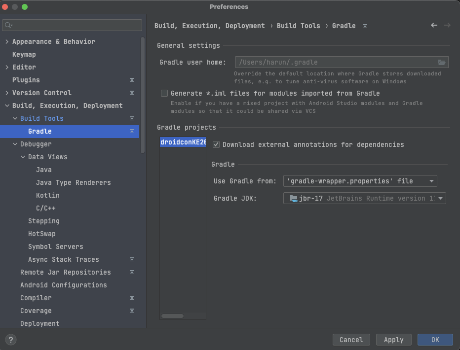
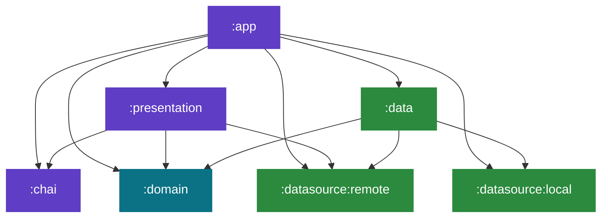
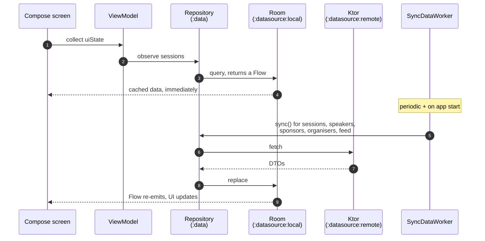

# droidcon Kenya — Android 🔥🔨

[](https://github.com/droidconKE/droidconKeKotlin/actions/workflows/pr.yml)
[](https://codecov.io/gh/droidconKE/droidconKeKotlin)
[](LICENSE)
[](CONTRIBUTING.md)

[](https://kotlinlang.org)
[](https://developer.android.com/jetpack/compose/bom)
[](https://developer.android.com/build/releases/gradle-plugin)
[](https://gradle.org)
[](https://developer.android.com/tools/releases/platforms)
[](https://m3.material.io)

The official Android app for **droidcon Kenya**, the Android developer conference held in
Nairobi. It carries the schedule, speakers, sponsors, organisers and event feed, works
offline once it has synced, and lets attendees bookmark the sessions they plan to attend.

The app is also the community's shared teaching codebase: a current, opinionated,
multi-module Android project that people learn from and contribute to. Most of the
decisions in here are written down rather than assumed — see [`docs/`](docs/) and
[`AGENTS.md`](AGENTS.md).

---

## Contents

- [Running the project](#running-the-project)
- [Module layout](#module-layout)
- [Architecture](#architecture)
- [Tech stack](#tech-stack)
- [Quality gates](#quality-gates)
- [Testing](#testing)
- [Adding a dependency](#adding-a-dependency)
- [Contributing](#contributing)
- [Contributors](#contributors)
- [Licence](#licence)

---

## Running the project

You need **JDK 17**. Nothing else — the Android SDK components, the Gradle distribution and
the emulators used by the instrumentation tests are all provisioned by the build.

```bash
git clone https://github.com/droidconKE/droidconKeKotlin.git
cd droidconKeKotlin
./gradlew assembleDebug
```

Confirm the toolchain first if the build cannot find Java 17:

```bash
./gradlew --version
```

Android Studio ships its own JDK, so the simplest fix is to point Gradle at it. In the IDE,
**File → Project Structure → SDK Location → Gradle Settings**, set the Gradle JDK to 17:



Or set it for every project in your **global** `~/.gradle/gradle.properties`:

```properties
org.gradle.java.home=/Applications/Android Studio.app/Contents/Home/jbr/Contents/Home
```

The debug build is signed with the checked-in `keystore/dckedebug.keystore`, so a fresh
clone installs and runs without any local signing setup.

---

## Module layout

| Module               | What lives there                                                       |
|----------------------|------------------------------------------------------------------------|
| `app`                | `Application`, the activity host, the manifest, the DI graph root       |
| `presentation`       | Every Compose screen, ViewModel and the navigation graph                |
| `chai`               | The design system — colours, typography, shared components              |
| `domain`             | Pure Kotlin models and repository interfaces. No Android dependency     |
| `data`               | Repository implementations, the sync worker, mappers                    |
| `datasource:local`   | Room database, DAOs, entities                                           |
| `datasource:remote`  | Ktor client, DTOs, Remote Config                                        |
| `build-logic`        | Convention plugins — every module's build config comes from here        |


```mermaid
graph TD
    app[":app"]
    presentation[":presentation"]
    chai[":chai"]
    data[":data"]
    domain[":domain"]
    local[":datasource:local"]
    remote[":datasource:remote"]

    app --> presentation
    app --> chai
    app --> data
    app --> domain
    app --> local
    app --> remote

    presentation --> chai
    presentation --> domain
    presentation --> remote

    data --> domain
    data --> local
    data --> remote

    classDef pure fill:#0b7285,stroke:#0b7285,color:#ffffff;
    classDef ui fill:#5f3dc4,stroke:#5f3dc4,color:#ffffff;
    classDef io fill:#2b8a3e,stroke:#2b8a3e,color:#ffffff;
    class domain pure;
    class app,presentation,chai ui;
    class data,local,remote io;
```

**The dependency rule:** `domain` depends on nothing. `data` depends on `domain` and never
the reverse. `presentation` does not reach into `datasource:local`. Keeping `domain` free of
Android imports is what would make a move to Kotlin Multiplatform a port rather than a
rewrite.

Note that the two `datasource` modules do not depend on `domain` either. They own their own
DTOs and Room entities and know nothing about the domain model; `data` is the only module
that sees both sides, and the mappers there are the seam. That is why swapping the API
representation of a session does not reach the UI.

A new module applies the convention plugins rather than copying a `build.gradle.kts`:

```kotlin
plugins {
    alias(libs.plugins.droidconke.android.library)
    alias(libs.plugins.droidconke.android.hilt)
}
```

---

## Architecture

Offline-first. The UI never waits on the network: screens read from Room, and a WorkManager
job refreshes Room from the API in the background. A cold start with no connection still
shows the last synced schedule.


```mermaid
sequenceDiagram
    autonumber
    participant UI as Compose screen
    participant VM as ViewModel
    participant Repo as Repository<br/>(:data)
    participant Room as Room<br/>(:datasource:local)
    participant Ktor as Ktor<br/>(:datasource:remote)
    participant Work as SyncDataWorker

    UI->>VM: collect uiState
    VM->>Repo: observe sessions
    Repo->>Room: query, returns a Flow
    Room-->>UI: cached data, immediately

    Note over Work: periodic + on app start
    Work->>Repo: sync() for sessions, speakers,<br/>sponsors, organisers, feed
    Repo->>Ktor: fetch
    Ktor-->>Repo: DTOs
    Repo->>Room: replace
    Room-->>UI: Flow re-emits, UI updates
```

The five repositories sync concurrently and the job only reports success when all of them
succeed, so a partial refresh is retried rather than treated as done.

Fuller treatment, including the navigation model and the Room schema: **[docs/architecture.md](docs/architecture.md)**.

---

## Tech stack

| Concern            | Choice                                                        |
|--------------------|---------------------------------------------------------------|
| Language           | Kotlin 2.4, coroutines and Flow                               |
| UI                 | Jetpack Compose, Material 3, `chai` design system             |
| Navigation         | **Navigation 3** — `@Serializable` `NavKey`s, no route strings |
| DI                 | Hilt with KSP                                                 |
| Networking         | Ktor 3 with kotlinx.serialization                             |
| Persistence        | Room 2.8, DataStore                                           |
| Background work    | WorkManager                                                   |
| Images             | Coil                                                          |
| Firebase           | Crashlytics, Remote Config, Messaging, Performance            |
| Logging            | Timber                                                        |
| Tests              | JUnit4, Robolectric, MockK, Turbine, Compose UI test          |

Navigation 3 is not Navigation 2 renamed. Destinations are `@Serializable` keys implementing
`NavKey`; there is no `NavHost` and there are no route strings. See
`presentation/src/main/java/com/android254/presentation/common/navigation/`.

---

## Quality gates

Everything below runs on every pull request. Run it locally before pushing and CI holds no
surprises.

```bash
./gradlew spotlessApply ktlintFormat          # format first — the checks are strict
./gradlew spotlessCheck ktlintCheck detekt    # style and static analysis
./gradlew lint                                # Android Lint + Slack's Compose rules
./gradlew stabilityCheck                      # Compose recomposition regressions
./gradlew testDebugUnitTest                   # JVM + Robolectric
```

| Tool                                                                  | Catches                                                       |
|-----------------------------------------------------------------------|---------------------------------------------------------------|
| [spotless](https://github.com/diffplug/spotless)                       | Formatting and the Apache licence header on every file        |
| [ktlint](https://github.com/JLLeitschuh/ktlint-gradle)                 | Kotlin style, official code style                             |
| [detekt](https://detekt.dev)                                           | Complexity, code smells, `TODO` left in comments              |
| [Android Lint](https://developer.android.com/studio/write/lint)        | Platform, resource, manifest and API-level correctness        |
| [compose-lints](https://slackhq.github.io/compose-lints/)              | Compose API shape, state and stability mistakes               |
| [compose-stability-analyzer](https://github.com/skydoves/compose-stability-analyzer) | Composables that quietly stop being skippable  |

There is **no lint baseline and no ktlint baseline**. Severity decisions live in
[`config/lint/lint.xml`](config/lint/lint.xml), one rule per line with the reason next to it,
so every suppression shows up in a diff. What each tool is set to, why, and the debt still
being burned down: **[docs/static-analysis.md](docs/static-analysis.md)**.

---

## Testing

```bash
./gradlew testDebugUnitTest                                  # all unit tests
./gradlew :presentation:testDebugUnitTest --tests "*SessionsFilterStateTest*"
```

Instrumentation tests run on Gradle Managed Devices, so there is no emulator to create or
start — Gradle provisions and tears them down:

```bash
./gradlew :data:supportedApiLevelsGroupDebugAndroidTest       # api30 + api34
```

Coverage is measured with JaCoCo on debug variants and reported to Codecov.

---

## Adding a dependency

All dependencies are declared in
[`gradle/libs.versions.toml`](gradle/libs.versions.toml), a Gradle
[version catalog](https://docs.gradle.org/current/userguide/platforms.html#sub:version-catalog).
One place to look, one place to bump, and changing a version does not invalidate the
compilation of every module.

Add the version under `[versions]`, then the library under `[libraries]`:

```toml
[versions]
splash = "1.2.0"

[libraries]
androidx-splashscreen = { module = "androidx.core:core-splashscreen", version.ref = "splash" }
```

Then use it as `implementation(libs.androidx.splashscreen)` — Gradle normalises `-`, `_` and
`.` into `.` for the accessor. Check whether it belongs in an existing `[bundles]` entry
before adding it module by module.

To see what is out of date:

```bash
./gradlew dependencyUpdates
```

---

## Compose previews and ViewModels

A composable that calls `hiltViewModel()` cannot be previewed. Split it: keep a composable
that takes the ViewModel and immediately delegates to a second one that takes plain state and
callbacks, then preview the second. The
[Compose tooling docs](https://developer.android.com/jetpack/compose/tooling/previews#preview-viewmodel)
cover the pattern.

---

## Contributing

Contributions are welcome, and this repository is deliberately a good place to make a first
one. [`CONTRIBUTING.md`](CONTRIBUTING.md) covers the process — issues, forks, PR
expectations. [`AGENTS.md`](AGENTS.md) covers the things that have already cost this codebase
a bug and are easy to reintroduce; it is worth ten minutes before your first PR.

## Contributors

We would endlessly like to thank the following contributors

<!-- readme: contributors -start -->
<table>
	<tbody>
		<tr>
            <td align="center">
                <a href="https://github.com/chepsi">
                    
                    <br />
                    <sub><b>Evans Chepsiror</b></sub>
                </a>
            </td>
            <td align="center">
                <a href="https://github.com/donald-okara">
                    
                    <br />
                    <sub><b>Don Okara</b></sub>
                </a>
            </td>
            <td align="center">
                <a href="https://github.com/ndiritumichael">
                    
                    <br />
                    <sub><b>Michael Ndiritu</b></sub>
                </a>
            </td>
            <td align="center">
                <a href="https://github.com/wangerekaharun">
                    
                    <br />
                    <sub><b>Harun Wangereka</b></sub>
                </a>
            </td>
            <td align="center">
                <a href="https://github.com/kibettheophilus">
                    
                    <br />
                    <sub><b>Kibet Theo</b></sub>
                </a>
            </td>
            <td align="center">
                <a href="https://github.com/Raynafs">
                    
                    <br />
                    <sub><b>Rachel Murabula</b></sub>
                </a>
            </td>
		</tr>
		<tr>
            <td align="center">
                <a href="https://github.com/janewaitara">
                    
                    <br />
                    <sub><b>Jane Waitara</b></sub>
                </a>
            </td>
            <td align="center">
                <a href="https://github.com/yveskalume">
                    
                    <br />
                    <sub><b>Yves Kalume</b></sub>
                </a>
            </td>
            <td align="center">
                <a href="https://github.com/misshannah">
                    
                    <br />
                    <sub><b>Hannah Olukoye</b></sub>
                </a>
            </td>
            <td align="center">
                <a href="https://github.com/Borwe">
                    
                    <br />
                    <sub><b>Brian Orwe</b></sub>
                </a>
            </td>
            <td align="center">
                <a href="https://github.com/chege4179">
                    
                    <br />
                    <sub><b>Peter Chege</b></sub>
                </a>
            </td>
            <td align="center">
                <a href="https://github.com/robert-nganga">
                    
                    <br />
                    <sub><b>Robert Nganga</b></sub>
                </a>
            </td>
		</tr>
		<tr>
            <td align="center">
                <a href="https://github.com/michaelbukachi">
                    
                    <br />
                    <sub><b>Michael Bukachi</b></sub>
                </a>
            </td>
            <td align="center">
                <a href="https://github.com/KennethMathari">
                    
                    <br />
                    <sub><b>Kenneth Mathari</b></sub>
                </a>
            </td>
            <td align="center">
                <a href="https://github.com/jumaallan">
                    
                    <br />
                    <sub><b>Juma Allan</b></sub>
                </a>
            </td>
            <td align="center">
                <a href="https://github.com/MamboBryan">
                    
                    <br />
                    <sub><b>MamboBryan</b></sub>
                </a>
            </td>
            <td align="center">
                <a href="https://github.com/Jacquigee">
                    
                    <br />
                    <sub><b>Jacquiline Gitau</b></sub>
                </a>
            </td>
            <td align="center">
                <a href="https://github.com/paulodhiambo">
                    
                    <br />
                    <sub><b>Odhiambo Paul</b></sub>
                </a>
            </td>
		</tr>
		<tr>
            <td align="center">
                <a href="https://github.com/kanake10">
                    
                    <br />
                    <sub><b>N3</b></sub>
                </a>
            </td>
            <td align="center">
                <a href="https://github.com/emmanuelmuturia">
                    
                    <br />
                    <sub><b>Emmanuel Muturia</b></sub>
                </a>
            </td>
            <td align="center">
                <a href="https://github.com/jumapaul">
                    
                    <br />
                    <sub><b>Paul Juma</b></sub>
                </a>
            </td>
            <td align="center">
                <a href="https://github.com/cliffgor">
                    
                    <br />
                    <sub><b>Cliff Gor</b></sub>
                </a>
            </td>
            <td align="center">
                <a href="https://github.com/AmenyaEngr">
                    
                    <br />
                    <sub><b>Null</b></sub>
                </a>
            </td>
            <td align="center">
                <a href="https://github.com/Terry-Mochire">
                    
                    <br />
                    <sub><b>Terry Mochire</b></sub>
                </a>
            </td>
		</tr>
		<tr>
            <td align="center">
                <a href="https://github.com/whoisnjoguu">
                    
                    <br />
                    <sub><b>Titan</b></sub>
                </a>
            </td>
            <td align="center">
                <a href="https://github.com/mertoenjosh">
                    
                    <br />
                    <sub><b>Martin Thuo</b></sub>
                </a>
            </td>
            <td align="center">
                <a href="https://github.com/joelmuraguri">
                    
                    <br />
                    <sub><b>Joel  Muraguri</b></sub>
                </a>
            </td>
            <td align="center">
                <a href="https://github.com/etonotieno">
                    
                    <br />
                    <sub><b>Eton Otieno</b></sub>
                </a>
            </td>
            <td align="center">
                <a href="https://github.com/mog-rn">
                    
                    <br />
                    <sub><b>Amos Nyaburi</b></sub>
                </a>
            </td>
            <td align="center">
                <a href="https://github.com/lokified">
                    
                    <br />
                    <sub><b>Sheldon Okware</b></sub>
                </a>
            </td>
		</tr>
		<tr>
            <td align="center">
                <a href="https://github.com/joenjogu">
                    
                    <br />
                    <sub><b>Joenjogu</b></sub>
                </a>
            </td>
            <td align="center">
                <a href="https://github.com/zmhfh">
                    
                    <br />
                    <sub><b>Zmhfh</b></sub>
                </a>
            </td>
            <td align="center">
                <a href="https://github.com/anuragkanojiya1">
                    
                    <br />
                    <sub><b>Null</b></sub>
                </a>
            </td>
            <td align="center">
                <a href="https://github.com/stephenWanjala">
                    
                    <br />
                    <sub><b>Wanjala Stephen</b></sub>
                </a>
            </td>
            <td align="center">
                <a href="https://github.com/josphatmwania">
                    
                    <br />
                    <sub><b>Josphat Mwania</b></sub>
                </a>
            </td>
            <td align="center">
                <a href="https://github.com/Jeremy-Gitau">
                    
                    <br />
                    <sub><b>Jeremy</b></sub>
                </a>
            </td>
		</tr>
		<tr>
            <td align="center">
                <a href="https://github.com/Dbriane208">
                    
                    <br />
                    <sub><b>Null</b></sub>
                </a>
            </td>
            <td align="center">
                <a href="https://github.com/princemill">
                    
                    <br />
                    <sub><b>Chris Matee</b></sub>
                </a>
            </td>
            <td align="center">
                <a href="https://github.com/BKinya">
                    
                    <br />
                    <sub><b>Beatrice Kinya</b></sub>
                </a>
            </td>
            <td align="center">
                <a href="https://github.com/tamzi">
                    
                    <br />
                    <sub><b>Tamzi</b></sub>
                </a>
            </td>
		</tr>
	<tbody>
</table>
<!-- readme: contributors -end -->
---

## Licence

```
Copyright 2026 droidcon Kenya

Licensed under the Apache License, Version 2.0 (the "License");
you may not use this file except in compliance with the License.
You may obtain a copy of the License at

    http://www.apache.org/licenses/LICENSE-2.0

Unless required by applicable law or agreed to in writing, software
distributed under the License is distributed on an "AS IS" BASIS,
WITHOUT WARRANTIES OR CONDITIONS OF ANY KIND, either express or implied.
See the License for the specific language governing permissions and
limitations under the License.
```
