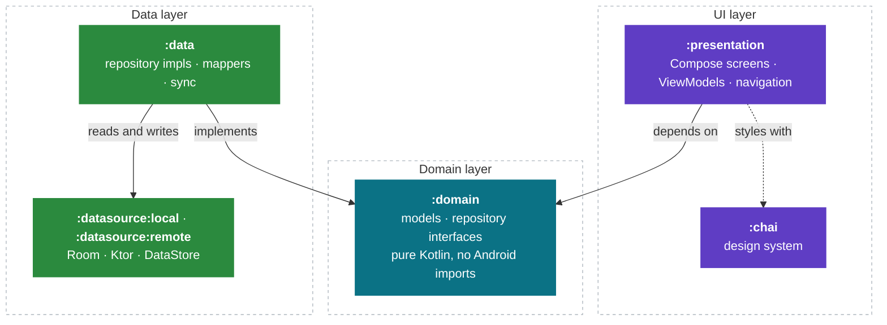
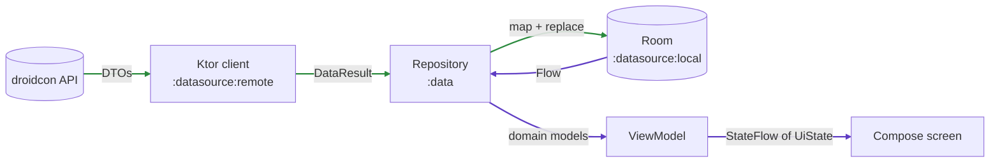
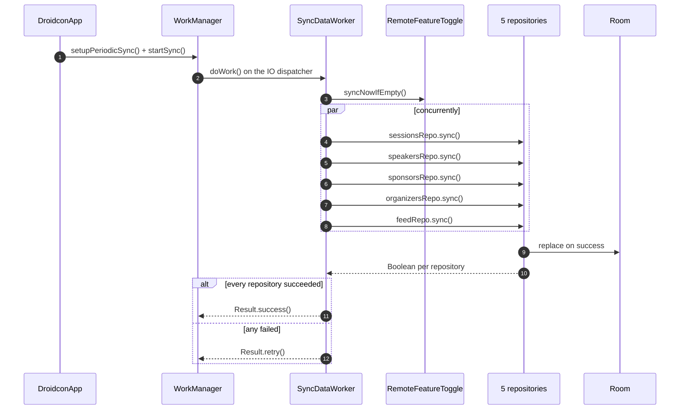

# Architecture

How the droidcon Kenya Android app is put together, and why.

This is the reference document. [`AGENTS.md`](../AGENTS.md) is the short version, plus the
list of mistakes that have already cost this codebase a bug.

- [The shape of it](#the-shape-of-it)
- [Modules](#modules)
- [Offline first](#offline-first)
- [Sync](#sync)
- [Persistence](#persistence)
- [Navigation](#navigation)
- [Presentation](#presentation)
- [Design system](#design-system)
- [Build logic](#build-logic)

---

## The shape of it

Three layers, in the usual order, with a strict rule about which way the arrows point.



Both `presentation` and `data` point at `domain`. Nothing points out of it. `domain` is
plain Kotlin with no Android imports at all, which is the property that would make a move to
Kotlin Multiplatform a port rather than a rewrite — and the reason a change to the API
response shape cannot reach a ViewModel without passing through a mapper someone had to
write.

---

## Modules

| Module              | Gradle plugins                            | Contains                                          |
|---------------------|-------------------------------------------|---------------------------------------------------|
| `app`               | application, hilt, firebase, jacoco        | `DroidconApp`, manifest, DI root                  |
| `presentation`      | library, hilt, compose, stability, jacoco  | Screens, ViewModels, navigation, notifications    |
| `chai`              | library, compose, stability, jacoco        | Colours, typography, shared components            |
| `domain`            | library, jacoco                            | Models, repository interfaces, `Synchronizer`     |
| `data`              | library, hilt, firebase, jacoco            | Repository impls, mappers, `SyncDataWorker`       |
| `datasource:local`  | library, room, hilt, firebase, jacoco      | Room DB, DAOs, entities, DataStore                |
| `datasource:remote` | library, hilt, firebase, jacoco            | Ktor client, DTOs, Remote Config                  |
| `build-logic`       | —                                          | The convention plugins the above apply            |

The two `datasource` modules do not depend on `domain`. They own their own DTOs and Room
entities. `data` is the only module that sees both representations, and the mappers there are
the seam between them.

Seven repository interfaces live in `domain/repos`: `AuthRepo`, `FeedRepo`, `HomeRepo`,
`OrganizersRepo`, `SessionsRepo`, `SpeakersRepo`, `SponsorsRepo`. Their implementations in
`data/repos` are named `*Manager` for historical reasons rather than `*RepoImpl`.

---

## Offline first

The UI never waits on the network. Screens observe Room; Room is refreshed from the API in
the background. A cold start with the radio off still shows the last synced schedule, and a
sync landing mid-scroll updates the list underneath the user without a spinner.



The green path runs on the sync worker's schedule. The purple path runs whenever Room
changes. They are only ever connected through the database — no repository hands a network
result straight to a ViewModel, which is what keeps a failed request from blanking a screen
that already had data.

---

## Sync

`SyncDataWorker` is a Hilt-injected `CoroutineWorker` that implements `domain.sync.Synchronizer`.
It runs periodically and once on app start, from `DroidconApp.onCreate`.



The five run concurrently under `awaitAll` and the result is `.all { it }` — one failure
retries the whole job. That is deliberate: a half-synced database, where the sessions are
current but the speakers they reference are not, is worse than a slightly stale one.

The worker posts a foreground notification while it runs, so the sync survives the app being
backgrounded mid-refresh.

---

## Persistence

Room 2.8, six entities and their DAOs:

| Entity            | DAO              | Notes                                        |
|-------------------|------------------|----------------------------------------------|
| `SessionEntity`   | `SessionDao`     | The schedule                                 |
| `SpeakerEntity`   | `SpeakerDao`     |                                              |
| `SponsorEntity`   | `SponsorsDao`    |                                              |
| `OrganizerEntity` | `OrganizersDao`  |                                              |
| `FeedEntity`      | `FeedDao`        |                                              |
| `BookmarkEntity`  | `BookmarkDao`    | **User-owned data. Never destructively migrated.** |

`BaseDao` holds the shared insert/update/delete surface.

Two rules here have already been paid for:

**There is no `fallbackToDestructiveMigration()`.** A schema change without a matching
migration must fail loudly. Silently dropping the table takes an attendee's bookmarked
sessions — their personal conference agenda — with it. New migrations go in
`Database.ALL_MIGRATIONS`, and `DatabaseMigrationTest` fails if the fallback ever returns.

**Session times are venue-local.** The API sends them without an offset and they mean
`Africa/Nairobi`. Use `@ConferenceTimeZone` for absolute times and the device clock only for
relative ones ("in 20 minutes"). There is no `SimpleDateFormat` in production code and there
should not be — it is not thread-safe.

---

## Navigation

**Navigation 3**, which is not Navigation 2 with a new name. There is no `NavHost` and there
are no route strings. A destination is a `@Serializable` object or class implementing
`NavKey`, and the back stack is a list of them that the app owns.

```
presentation/common/navigation/
├── Screens.kt              the NavKeys
├── Navigation.kt           the NavDisplay setup
├── NavigationController.kt back stack operations
├── NavigationState.kt      the back stack itself
├── DroidconEntryProvider.kt key -> screen wiring
├── TopLevelDestination.kt  bottom bar entries: icon, label, key
└── NavigationAnimation.kt  transitions
```

**Keys carry no display metadata.** They are serialized into `SavedState`, so they must be
immutable and must never hold a resource ID — a resource ID is not stable across builds.
Icons and labels belong in `TopLevelDestination`.

---

## Presentation

One package per feature: `about`, `auth`, `feed`, `feedback`, `home`, `sessionDetails`,
`sessions`, `speakers`, plus `common` for shared components and `models` for the
presentation-layer models.

The rules that matter:

- **ViewModels own state; composables derive it.** Do not mirror ViewModel state in a
  `remember` — that is how the UI and the data end up disagreeing after a rotation.
- **Lazy lists need a stable `key`.** Without one, scroll position jumps the moment a sync
  reorders the list.
- **Strings live in `strings.xml`.** No user-visible text in Kotlin.
- **Filter options are derived from session data, not typed by hand.** Hardcoded values drift
  from what the API returns, and the failure is invisible: the chip highlights and the list
  comes back empty. `SessionsFilterOptionsTest` asserts that no offered option matches zero
  sessions.
- **`Session.rooms` is comma-joined.** A session can run in two rooms. Compare against
  `Session.roomList`, not the joined string.

---

## Design system

`chai` holds the colours, typography and shared components. Read
`MaterialTheme.chaiColorsPalette` for semantic colours or `MaterialTheme.colorScheme` for
Material roles. Do not import `ChaiBlue` and friends outside `chai/colors`.

One caveat worth knowing before you add a component: **chai currently runs alongside Material
3 rather than underneath it.** `ChaiTheme` does not pass a `colorScheme`, so stock Material
components render in Material's default purple. If a new component's colours look wrong, that
is why. Pass colours explicitly until the design-system rebuild lands — see
[`IMPROVEMENT_PLAN.md`](IMPROVEMENT_PLAN.md).

---

## Build logic

Every module's build configuration comes from a convention plugin in `build-logic`. No module
sets its own `compileSdk`, `minSdk`, Java version or test runner.

| Plugin id                              | Applies                                              |
|----------------------------------------|------------------------------------------------------|
| `droidconke.android.application`       | AGP application + shared Kotlin/Android config       |
| `droidconke.android.library`           | AGP library + shared Kotlin/Android config           |
| `droidconke.android.library.compose`   | Compose, the Compose BOM, the Compose bundle         |
| `droidconke.android.hilt`              | Hilt + KSP                                           |
| `droidconke.android.room`              | Room + schema export                                 |
| `droidconke.android.*.firebase`        | Firebase BOM and the plugins                         |
| `droidconke.android.*.jacoco`          | Coverage, debug variants only                        |

`KotlinAndroid.kt` is the shared base: SDK levels from the version catalog, Java 17, core
library desugaring, the opt-ins, the lint configuration, the managed devices, and the Slack
Compose lint checks.

The build runs on **AGP's built-in Kotlin**. `org.jetbrains.kotlin.android` is not applied
anywhere, and `android.newDsl` and `android.builtInKotlin` are both left at their AGP 9
defaults. Do not add the Kotlin Android plugin back — under the new DSL, applying both is a
hard error, not a warning.

Instrumentation tests run on Gradle Managed Devices declared in `ManagedDevices.kt`: `api30`
and `api34`, both `aosp-atd`, with the ABI keyed off the host so CI and Apple Silicon each
resolve a native image.

**`minSdk` is 26, and that is what makes `java.time` safe.** It used to be 24, where
`java.time` is absent and the app threw `NoClassDefFoundError` during the first sync unless
desugaring backported it. `isCoreLibraryDesugaringEnabled` is still on for the newer
`java.time` additions, but it is no longer the only thing between the app and a launch crash.
Do not lower `minSdk` below 26.

---

## Where this is going

[`IMPROVEMENT_PLAN.md`](IMPROVEMENT_PLAN.md) is the roadmap: an audit of the current state,
then phased work covering adaptive and large-screen support, a design-system rebuild onto
Material 3 Expressive, on-device and cloud AI features, ticketing, performance and testing.

Read §1.3 (known defects) and §16.0 (the P0 list) before starting anything substantial. Some
of what looks like a bug is already documented, and some of what looks intentional is a
defect with a fix already specified.
