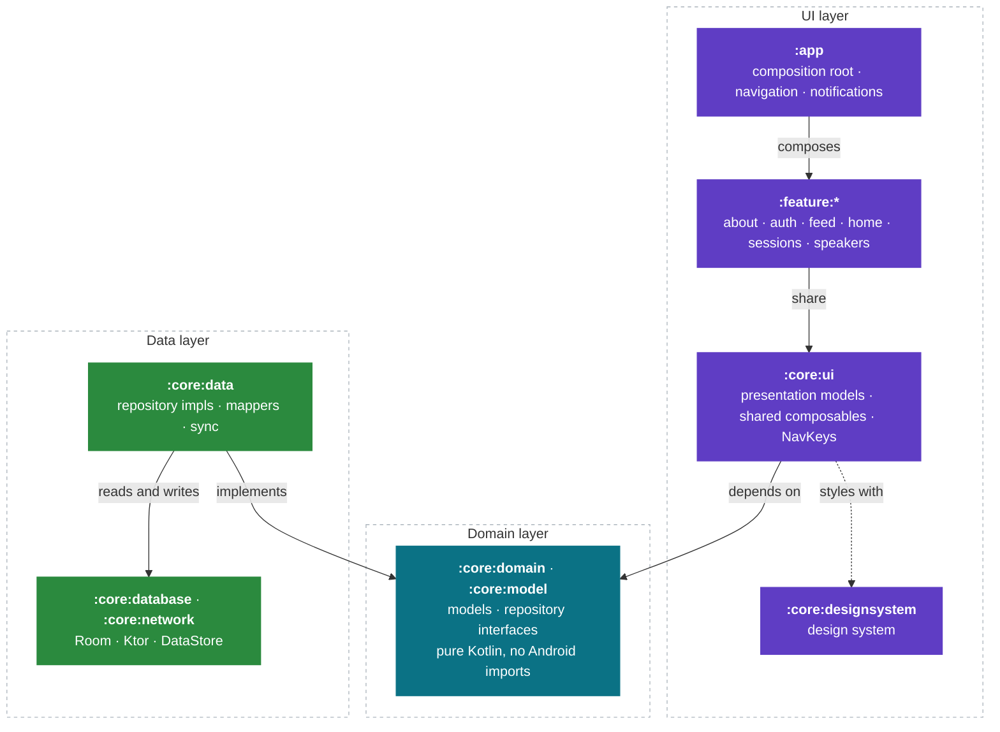
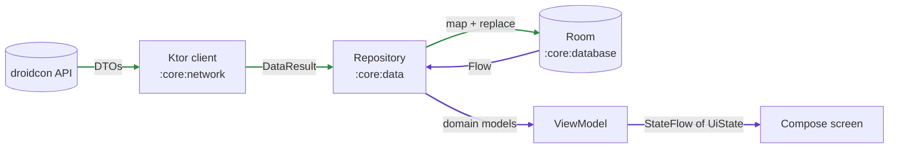
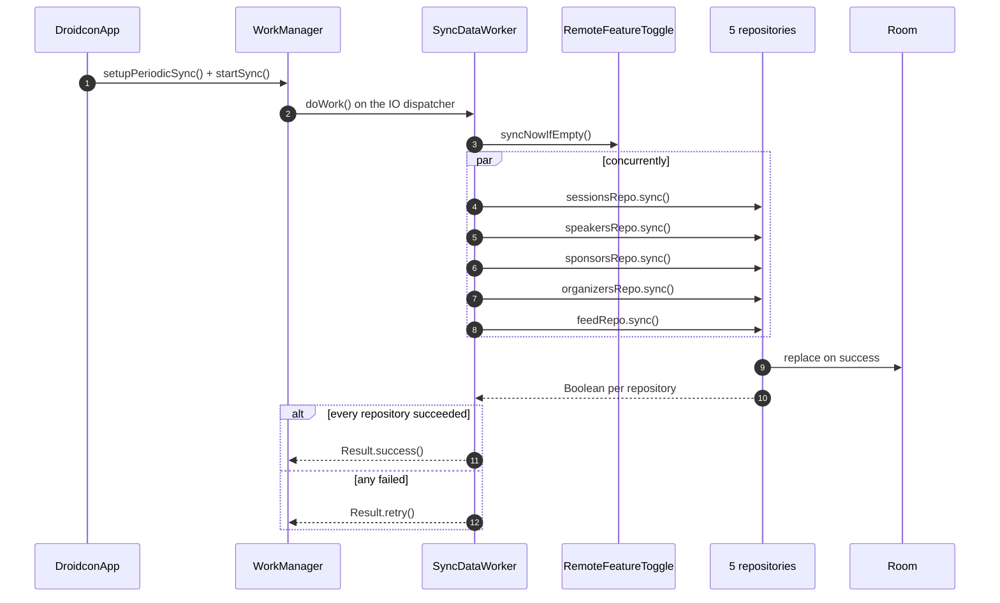

# Architecture

How the droidcon Kenya Android app is put together, and why.

This is the reference document. [`AGENTS.md`](../AGENTS.md) is the short version, plus the
list of mistakes that have already cost this codebase a bug.

- [The shape of it](#the-shape-of-it)
- [Modules](#modules)
- [Offline first](#offline-first)
- [Sync](#sync)
- [Persistence](#persistence)
- [Navigation](#navigation)
- [Presentation](#presentation)
- [Design system](#design-system)
- [Build logic](#build-logic)

---

## The shape of it

Three layers, in the usual order, with a strict rule about which way the arrows point.


```mermaid
graph TD
    subgraph L1["UI layer"]
        APP["<b>:app</b><br/>composition root · navigation · notifications"]
        FEAT["<b>:feature:*</b><br/>about · auth · feed · home · sessions · speakers"]
        UIL["<b>:core:ui</b><br/>presentation models · shared composables · NavKeys"]
        CHAI["<b>:core:designsystem</b><br/>design system"]
    end

    subgraph L2["Domain layer"]
        DOML["<b>:core:domain</b> · <b>:core:model</b><br/>models · repository interfaces<br/>pure Kotlin, no Android imports"]
    end

    subgraph L3["Data layer"]
        DATAL["<b>:core:data</b><br/>repository impls · mappers · sync"]
        SRC["<b>:core:database</b> · <b>:core:network</b><br/>Room · Ktor · DataStore"]
    end

    APP -->|"composes"| FEAT
    FEAT -->|"share"| UIL
    UIL -->|"depends on"| DOML
    UIL -.->|"styles with"| CHAI
    DATAL -->|"implements"| DOML
    DATAL -->|"reads and writes"| SRC

    style DOML fill:#0b7285,stroke:#0b7285,color:#ffffff
    style APP fill:#5f3dc4,stroke:#5f3dc4,color:#ffffff
    style FEAT fill:#5f3dc4,stroke:#5f3dc4,color:#ffffff
    style UIL fill:#5f3dc4,stroke:#5f3dc4,color:#ffffff
    style CHAI fill:#5f3dc4,stroke:#5f3dc4,color:#ffffff
    style DATAL fill:#2b8a3e,stroke:#2b8a3e,color:#ffffff
    style SRC fill:#2b8a3e,stroke:#2b8a3e,color:#ffffff
    style L1 fill:#ffffff,stroke:#adb5bd,stroke-dasharray:4 4
    style L2 fill:#ffffff,stroke:#adb5bd,stroke-dasharray:4 4
    style L3 fill:#ffffff,stroke:#adb5bd,stroke-dasharray:4 4
```

Both the UI layer and `core:data` point at `core:domain`. Nothing points out of it, and
`core:model` under it is a JVM module the build keeps free of Android imports — the property
that would make a move to Kotlin Multiplatform a port rather than a rewrite, and the reason a
change to the API response shape cannot reach a ViewModel without passing through a mapper
someone had to write.

Within the UI layer the rule is that a feature never depends on another feature. Anything two
of them need lives in `core:ui`, and `app` is the only module allowed to see them all.

---

## Modules

| Module               | Gradle plugins                                     | Contains                                        |
|----------------------|----------------------------------------------------|-------------------------------------------------|
| `app`                | application, compose, hilt, firebase, stability, roborazzi, jacoco | `DroidconApp`, `MainActivity`, navigation, notifications, DI root |
| `feature:*`          | feature (+ roborazzi)                              | Screens, ViewModels, tests, goldens             |
| `core:ui`            | library, compose, stability, jacoco                | Presentation models, shared composables, NavKeys |
| `core:designsystem`  | library, compose, stability, jacoco                | Colours, typography, shared components          |
| `core:common`        | library                                            | Dispatcher and time-zone qualifiers             |
| `core:model`         | jvm library                                        | Pure Kotlin data classes                        |
| `core:domain`        | library, jacoco                                    | Repository interfaces, `Synchronizer`           |
| `core:data`          | library, hilt, firebase, jacoco                    | Repository impls, mappers, `SyncDataWorker`     |
| `core:database`      | library, room, hilt, firebase, jacoco              | Room DB, DAOs, entities, DataStore              |
| `core:network`       | library, hilt, firebase, jacoco                    | Ktor client, DTOs, Remote Config                |
| `core:screenshot`    | library, compose                                   | Roborazzi harness. Test-only                    |
| `core:testing`       | library                                            | Shared test doubles. Test-only                  |
| `benchmarks`         | com.android.test                                   | Macrobenchmark + profile generation. Not shipped |
| `build-logic`        | —                                                  | The convention plugins the above apply          |

The `:core:*` renames of the data tier changed Gradle paths only. `:core:database` is still
`ke.droidcon.kotlin.datasource.local` in source, the way `:core:designsystem` is still
`com.droidconke.chai`.

There is no `core:datastore`. The preferences code is two files in `core:data`, too little to be a
module of its own. Modules the roadmap still needs, such as `core:ai` and `feature:ticket`, are
created with the work that needs them rather than ahead of it.

`core:database` and `core:network` do not depend on `core:domain`. They own their own DTOs and
Room entities. `core:data` is the only module that sees both representations, and the mappers
there are the seam between them.

Seven repository interfaces live in `core/domain`'s `repos` package: `AuthRepo`, `FeedRepo`, `HomeRepo`,
`OrganizersRepo`, `SessionsRepo`, `SpeakersRepo`, `SponsorsRepo`. Their implementations in
`data/repos` are named `*Manager` for historical reasons rather than `*RepoImpl`.

---

## Offline first

The UI never waits on the network. Screens observe Room; Room is refreshed from the API in
the background. A cold start with the radio off still shows the last synced schedule, and a
sync landing mid-scroll updates the list underneath the user without a spinner.


```mermaid
flowchart LR
    API[("droidcon API")]
    Ktor["Ktor client<br/>:core:network"]
    Repo["Repository<br/>:core:data"]
    Room[("Room<br/>:core:database")]
    VM["ViewModel"]
    UI["Compose screen"]

    API -->|"DTOs"| Ktor
    Ktor -->|"DataResult"| Repo
    Repo -->|"map + replace"| Room
    Room -->|"Flow"| Repo
    Repo -->|"domain models"| VM
    VM -->|"StateFlow of UiState"| UI

    linkStyle 0,1,2 stroke:#2b8a3e,stroke-width:2px
    linkStyle 3,4,5 stroke:#5f3dc4,stroke-width:2px
```

The green path runs on the sync worker's schedule. The purple path runs whenever Room
changes. They are only ever connected through the database — no repository hands a network
result straight to a ViewModel, which is what keeps a failed request from blanking a screen
that already had data.

---

## Sync

`SyncDataWorker` is a Hilt-injected `CoroutineWorker` that implements `domain.sync.Synchronizer`.
It runs periodically and once on app start, from `DroidconApp.onCreate`.


```mermaid
sequenceDiagram
    autonumber
    participant App as DroidconApp
    participant WM as WorkManager
    participant W as SyncDataWorker
    participant RC as RemoteFeatureToggle
    participant R as 5 repositories
    participant DB as Room

    App->>WM: setupPeriodicSync() + startSync()
    WM->>W: doWork() on the IO dispatcher
    W->>RC: syncNowIfEmpty()
    par concurrently
        W->>R: sessionsRepo.sync()
        W->>R: speakersRepo.sync()
        W->>R: sponsorsRepo.sync()
        W->>R: organizersRepo.sync()
        W->>R: feedRepo.sync()
    end
    R->>DB: replace on success
    R-->>W: Boolean per repository
    alt every repository succeeded
        W-->>WM: Result.success()
    else any failed
        W-->>WM: Result.retry()
    end
```

The five run concurrently under `awaitAll` and the result is `.all { it }` — one failure
retries the whole job. That is deliberate: a half-synced database, where the sessions are
current but the speakers they reference are not, is worse than a slightly stale one.

The worker posts a foreground notification while it runs, so the sync survives the app being
backgrounded mid-refresh.

---

## Persistence

Room 2.8, six entities and their DAOs:

| Entity            | DAO              | Notes                                        |
|-------------------|------------------|----------------------------------------------|
| `SessionEntity`   | `SessionDao`     | The schedule                                 |
| `SpeakerEntity`   | `SpeakerDao`     |                                              |
| `SponsorEntity`   | `SponsorsDao`    |                                              |
| `OrganizerEntity` | `OrganizersDao`  |                                              |
| `FeedEntity`      | `FeedDao`        |                                              |
| `BookmarkEntity`  | `BookmarkDao`    | **User-owned data. Never destructively migrated.** |

`BaseDao` holds the shared insert/update/delete surface.

Two rules here have already been paid for:

**There is no `fallbackToDestructiveMigration()`.** A schema change without a matching
migration must fail loudly. Silently dropping the table takes an attendee's bookmarked
sessions — their personal conference agenda — with it. New migrations go in
`Database.ALL_MIGRATIONS`, and `DatabaseMigrationTest` fails if the fallback ever returns.

**Session times are venue-local.** The API sends them without an offset and they mean
`Africa/Nairobi`. Use `@ConferenceTimeZone` for absolute times and the device clock only for
relative ones ("in 20 minutes"). There is no `SimpleDateFormat` in production code and there
should not be — it is not thread-safe.

---

## Navigation

**Navigation 3**, which is not Navigation 2 with a new name. There is no `NavHost` and there
are no route strings. A destination is a `@Serializable` object or class implementing
`NavKey`, and the back stack is a list of them that the app owns.

```
core/ui   common/navigation/
├── Screens.kt                the NavKeys
├── NavigationController.kt   back stack operations
├── NavigationState.kt        the back stacks, and the entry list NavDisplay renders
├── NavigationVisibility.kt   which routes show the navigation area, and which take a pane
├── TopLevelDestination.kt    navigation entries: icon, label, key
└── NavigationAnimation.kt    transitions

app       common/navigation/
├── Navigation.kt               the NavDisplay setup
├── DroidconEntryProvider.kt    key -> screen wiring, and each key's pane role
├── DroidconSceneStrategies.kt  the SceneStrategies that turn those roles into panes
└── DroidconNavigationSuite.kt  the navigation items, colours and drawer header
```

**Keys carry no display metadata.** They are serialized into `SavedState`, so they must be
immutable and must never hold a resource ID — a resource ID is not stable across builds.
Icons and labels belong in `TopLevelDestination`.

**Multi-pane layouts are scenes, not scaffolds.** A `NavEntry` carries metadata saying whether
it is a list, a detail, a main pane or a supporting pane, and `ListDetailSceneStrategy` /
`SupportingPaneSceneStrategy` read that metadata plus a `PaneScaffoldDirective` and decide whether
two entries can be on screen at once. So nothing in a screen branches on window size: the same
entry is a full screen on a phone and a pane on a tablet.

**The directive is measured, not read off the window.** Both strategies default it to
`calculatePaneScaffoldDirective(currentWindowAdaptiveInfoV2())`, and that default is wrong here:
the navigation component sits inside the window, so on an 841 dp foldable a 360 dp drawer leaves
481 dp that a window-sized directive still splits in two. `Navigation` wraps its display in a
`BoxWithConstraints` and builds the directive from that box (`rememberContentPaneDirective`).
`rememberIsMultiPaneWindow` stays window-level on purpose — it decides the furniture, and
`shouldShowNavigation` decides the navigation component, which decides the content width. Deriving
that one from the content width too would make the pair oscillate.

`ListDetailPaneScaffold` and `NavigableListDetailPaneScaffold` are **forbidden**, and
`AdaptiveInvariantsTest` fails the build on them. Each owns a `ThreePaneScaffoldNavigator` —
a second back stack, competing with the one `NavigationController` already keeps per top-level
destination.

One wrinkle worth knowing: the Material list-detail strategy expands a second pane whenever the
window has room and fills the list pane with whatever list entry it can find. Reached from
Home, a session detail has no list behind it, so `ListPaneRequiredSceneStrategy` declines the
scene and the detail takes the whole window with its app bar intact.

Back out of a detail pops one destination at a time
(`BackNavigationBehavior.PopUntilCurrentDestinationChange`). The Material default pops until the
scaffold *value* changes, and list-beside-placeholder has the same value as list-beside-detail, so
it kept going and popped the sessions list too. That default assumes the list is a sibling entry;
here it is a tab root.

`Screens.HappeningNow` is the exception to "the back stack is the truth": it is appended to the
displayed entries by `NavigationState.toEntries` when there is a column to spare, never pushed.
`Navigation` drops it again if the measured directive cannot lay out two panes — `NavDisplay`
falls back to drawing the last entry it was given, so a pane that will not fit beside the screen
becomes the screen.
It appears and disappears with the window rather than with a navigation event, and `goBack()`
never sees it.

---

## Presentation

One package per feature: `about`, `auth`, `feed`, `feedback`, `home`, `sessionDetails`,
`sessions`, `speakers`, plus `common` for shared components and `models` for the
presentation-layer models.

The rules that matter:

- **ViewModels own state; composables derive it.** Do not mirror ViewModel state in a
  `remember` — that is how the UI and the data end up disagreeing after a rotation.
- **Layout reads the window, not the configuration.** `rememberDroidconWindowSize()` gives
  Compact / Medium / Expanded and `rememberIsMultiPaneWindow()` answers "is there room for two
  panes", derived from the same directive the scene strategies use so the two cannot disagree.
  `Configuration.screenWidthDp` and `LocalConfiguration.orientation` are wrong in multi-window,
  wrong on a foldable mid-fold and wrong in a resizable window; `AdaptiveInvariantsTest` fails
  on either. Single-pane content is capped at 840 dp and centred by
  `Modifier.readablePaneWidth()` — 20 dp gutters stretched across a 1600 dp window are not a
  layout. The navigation drawer needs a tall window as well as a wide one: a phone in landscape
  (891 × 411 dp) is Expanded by width, and a drawer there would take a third of the screen, so it
  gets a rail. App bars drop their logo only when the drawer is there to carry it — both read
  `rememberShowsNavigationDrawer()`, so they cannot disagree.
- **Insets are owned, not inherited.** Screens nest `Scaffold`s — the composition root has one
  for the navigation area, each screen has one for its top bar — and a nested `Scaffold` left
  on its defaults will either double-pad an inset or drop it. So the ownership is explicit: the
  app bar pays for the top (`DroidconWindowInsets.appBar`); the root `NavigationSuiteScaffold`
  pays for whichever side its navigation component covers and *consumes exactly that* — the
  bottom under a bar, the start under a rail or drawer, nothing while it is hidden; and each
  screen declares the remainder (`DroidconWindowInsets.screenContent`). Because the root
  consumes what it pays for, that one declaration is right at every window size. A root that
  consumed everything, which is what this used to be, leaves the edge-to-edge opt-in doing
  nothing: no screen can reach the status bar.
  Insets reach a scrolling list through its `contentPadding`; padding the list's parent clips
  it and stops its content scrolling behind the system bars. A container that pads by the
  insets *and* scrolls must consume them too.
- **Lazy lists need a stable `key`.** Without one, scroll position jumps the moment a sync
  reorders the list.
- **Strings live in `strings.xml`.** No user-visible text in Kotlin.
- **Filter options are derived from session data, not typed by hand.** Hardcoded values drift
  from what the API returns, and the failure is invisible: the chip highlights and the list
  comes back empty. `SessionsFilterOptionsTest` asserts that no offered option matches zero
  sessions.
- **`Session.rooms` is comma-joined.** A session can run in two rooms. Compare against
  `Session.roomList`, not the joined string.

---

## Design system

`chai` holds the colours, typography, shapes and shared components, and sits underneath Material
3 Expressive rather than beside it. `ChaiTheme` provides `MaterialExpressiveTheme` with chai's
`colorScheme`, `typography` (base and `*Emphasized` roles), `shapes`, and the expressive
`MotionScheme`, so stock Material components are on-brand without passing colours.

The palette is the 2026 brand from droidcon.co.ke: the website's blue and green ramps and its
neutrals, in `atoms/Color.kt`. Blue leads in light mode and neon green in dark, as on the website,
because blue text on black is only 3.7:1. Dark mode is true black with `#191D1D` cards. Neon green
is never text on a light surface (1.36:1 on white): in light mode it is a fill with ink on it. It
is text only on black (dark `primary`) and as headline-size text on the blue hero (4.1:1). Selected states (the navigation pill, the chosen day, a starred session, the live
badge) take `secondaryContainer` explicitly, because Material's default is `primary`.

Read `MaterialTheme.colorScheme` for colour. `MaterialTheme.chaiColorsPalette` holds three
tokens for the brand-blue hero panel, the one colour no role holds in both themes. Add a token
only when no role fits. A detekt `ForbiddenImport` rule fails the build on a palette import
outside `chai/colors` and `chai/atoms`.

Shapes are Material 3 Expressive's scale (4 to 48 dp). Typography is Montserrat, including
ExtraBold for the Emphasized display and headline roles. The website's display face, Rauschen B,
isn't bundled: its web licence doesn't cover embedding in an APK, the file is a `.woff2`, and
it has one weight. Swapping it in later is a change to the one `FontFamily` in `ChaiTypography`.

`MaterialTheme.isDarkTheme` reads the theme's own background rather than the system setting, so a
`ChaiTheme(darkTheme = true)` preview or screenshot picks the right logo.

Shared Expressive pieces live in `:core:ui`: `BookmarkButton` (the circle-to-cookie morph),
`LiveBadge`, `EmptyStatePanel`, `FilterOptionChips`, `ConnectedToggleGroup`,
`rememberSpeakerAvatarShape()`, `LogoTile` (partner logos, falling back to the next URL and then
the name) and `EvenGrid` (equal-width rows that line up). Button labels are sentence case.

Every square headshot (home, the speakers list, organisers) takes `rememberSpeakerAvatarShape()` and a
`HeadshotRingWidth` neon ring. Large photos on detail screens keep their rounded rectangles.

The Expressive APIs are only public in material3 1.5.0-alpha29, which the version catalog pins
over the BOM — see `AGENTS.md`.

---

## Build logic

Every module's build configuration comes from a convention plugin in `build-logic`. No module
sets its own `compileSdk`, `minSdk`, Java version or test runner.

| Plugin id                              | Applies                                              |
|----------------------------------------|------------------------------------------------------|
| `droidconke.android.application`       | AGP application + shared Kotlin/Android config       |
| `droidconke.android.library`           | AGP library + shared Kotlin/Android config           |
| `droidconke.android.library.compose`   | Compose, the Compose BOM, the Compose bundle         |
| `droidconke.android.hilt`              | Hilt + KSP                                           |
| `droidconke.android.room`              | Room + schema export                                 |
| `droidconke.android.*.firebase`        | Firebase BOM and the plugins                         |
| `droidconke.android.*.jacoco`          | Coverage, debug variants only                        |

`KotlinAndroid.kt` is the shared base: SDK levels from the version catalog, Java 17, core
library desugaring, the opt-ins, the lint configuration, the managed devices, and the Slack
Compose lint checks.

The build runs on **AGP's built-in Kotlin**. `org.jetbrains.kotlin.android` is not applied
anywhere, and `android.newDsl` and `android.builtInKotlin` are both left at their AGP 9
defaults. Do not add the Kotlin Android plugin back — under the new DSL, applying both is a
hard error, not a warning. Two `gradle.properties` settings that older guides recommend are wrong
under AGP 9: `android.nonFinalResIds=false` makes `minifyReleaseWithR8` fail once optimized
resource shrinking is on, and `android.defaults.buildfeatures.buildconfig` is deprecated.

Both the application and library plugins set `unitTests.isIncludeAndroidResources`. Without it
Robolectric cannot see the merged manifest, cannot resolve the `ComponentActivity` that
`compose-ui-test-manifest` contributes, and every `createComposeRule()` test fails. `app`'s
`src/test/resources/robolectric.properties` pins a plain `Application`, because
`DroidconApp.onCreate` starts WorkManager and the second test class to boot it fails with
"WorkManager is already initialized".

Instrumentation tests run on Gradle Managed Devices declared in `ManagedDevices.kt`: `api30`
and `api34`, both `aosp-atd`, with the ABI keyed off the host so CI and Apple Silicon each
resolve a native image.

**`minSdk` is 26, and that is what makes `java.time` safe.** It used to be 24, where
`java.time` is absent and the app threw `NoClassDefFoundError` during the first sync unless
desugaring backported it. `isCoreLibraryDesugaringEnabled` is still on for the newer
`java.time` additions, but it is no longer the only thing between the app and a launch crash.
Do not lower `minSdk` below 26.

---

## Where this is going

[`IMPROVEMENT_PLAN.md`](IMPROVEMENT_PLAN.md) is the roadmap. It lists pending work only, in
phases: the rest of the Material 3 Expressive design system, accessibility, on-device and cloud
AI features, ticketing, notifications, performance and testing.

Read §16.1 (the priority order) before starting anything substantial, and §3.9 for fixed
defects that still have no regression test.
