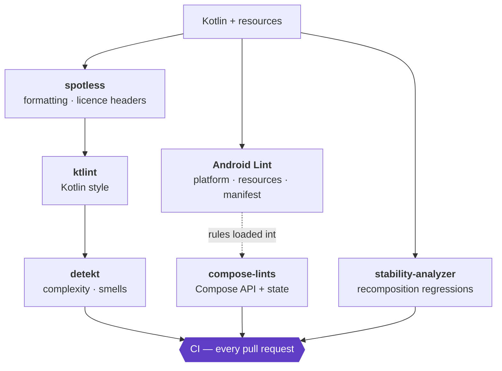

# Static analysis

What runs, what it is set to, and what is still outstanding.

- [The stack](#the-stack)
- [Running it](#running-it)
- [Why there are no baselines](#why-there-are-no-baselines)
- [Severity policy](#severity-policy)
- [Current position](#current-position)
- [Compose stability](#compose-stability)
- [Known gaps](#known-gaps)

---

## The stack



| Tool | Version | Scope | Config |
|------|---------|-------|--------|
| [spotless](https://github.com/diffplug/spotless) | 8.9.0 | `**/*.kt`, `**/*.kts` | root `build.gradle.kts` |
| [ktlint](https://github.com/JLLeitschuh/ktlint-gradle) | 14.2.0 | every module | `.editorconfig` |
| [detekt](https://detekt.dev) | 1.23.8 | every module | `detekt.yml` |
| Android Lint | AGP 9.3.1 | every module | `config/lint/lint.xml`, `build-logic/.../Lint.kt` |
| [compose-lints](https://slackhq.github.io/compose-lints/) | 1.5.4 | every module, via `lintChecks` | `config/lint/lint.xml` |
| [compose-stability-analyzer](https://github.com/skydoves/compose-stability-analyzer) | 0.12.0 | `:chai`, `:presentation` | `*/stability/*.stability` |

Slack's Compose rules are on the `lintChecks` classpath of **every** Android module, not just
the Compose ones. `config/lint/lint.xml` names those issue ids, and lint fails a module with
`UnknownIssueId` for every id it has not been given the checks for. The rules simply find
nothing in a module with no Compose code.

---

## Running it

```bash
./gradlew spotlessApply ktlintFormat          # format first; the checks below are strict
./gradlew spotlessCheck ktlintCheck detekt    # style and static analysis
./gradlew lint                                # Android Lint + the Compose rules
./gradlew stabilityCheck                      # composable stability against the baselines
```

Reports land in `<module>/build/reports/`. Lint writes HTML, XML, SARIF and text — AGP 9
always generates all four, so the report toggles no longer exist.

---

## Why there are no baselines

There used to be one: `app/lint-baseline.xml`, 726 lines, 66 entries. By the time it was
removed it described a codebase that no longer existed. It was generated by lint 8.10.1 while
the project had moved to AGP 9.3.1. It recorded absolute paths inside a contributor's home
directory. And 52 of its 66 entries were `GradleDependency`, `SimilarGradleDependency` and
`AndroidGradlePluginVersion` notices about dependency versions that had since been upgraded
several times over.

That is the failure mode of a baseline. It is written once, in a hurry, to make the build
green; it is never read again; and it silently absorbs new violations of any rule it already
mentions. The 14 real findings inside it had been invisible for years, one of which was a
manifest entry lint could not resolve.

Severity in `config/lint/lint.xml` does the same job better. Every decision is one line with
the reason next to it, and changing one shows up in a diff with a reviewer attached.

The ktlint baseline at `config/ktlint/baseline.xml` is empty and kept only because the plugin
points at it.

---

## Severity policy

Three levels, and they mean different things:

| Severity | Meaning |
|----------|---------|
| `error` | Enforced. Fails the build. Currently clean — every one of these has zero violations. |
| `warning` | Real, reported in CI and the IDE, being burned down. Does not block. |
| `informational` | Reported, deliberately not acted on, reason written next to it. |

**Promoting a rule from `warning` to `error` is the last commit of the work that clears it.**
That is the whole mechanism: the rule never gets switched off, the count only goes down, and
the day it hits zero it becomes permanent.

The build does *not* set `warningsAsErrors = true`. Doing so would force every newly adopted
rule to be either fully fixed or fully suppressed on the day it is added, which is how
projects end up with baselines.

---

## Current position

From `:app`'s lint run, which has `checkDependencies = true` and therefore sees the whole
module graph.

**0 errors. 162 warnings. 28 informational.**

| Rule | Count | What clearing it involves |
|------|-------|---------------------------|
| `ComposeModifierMissing` | 50 | Add `modifier: Modifier = Modifier` and apply it to the root layout |
| `ComposePreviewPublic` | 42 | Make `@Preview` composables private. Mechanical, no call sites |
| `ComposeParameterOrder` | 34 | Reorder to required, then modifier, then defaulted. Touches call sites |
| `ComposeUnstableCollections` | 20 | `List` → `ImmutableList`, or mark the holder `@Immutable` |
| `ComposeModifierReused` | 4 | One `SpeakerComponent.kt`; the modifier is applied to four children |
| `ComposeModifierWithoutDefault` | 3 | Add `= Modifier` |
| `ComposeViewModelInjection` | 2 | Move `hiltViewModel()` into a default parameter |
| `ComposeMultipleContentEmitters` | 2 | Wrap the two emitters in a single root layout |
| `CheckResult` | 2 | Two tests discard the result of `onNodeWithTag` / `onNodeWithText` |
| `ComposePreviewNaming` | 1 | `ChaiLightAndDarkComposePreview` → `…Previews` (2 preview annotations) |
| `ComposeRedundantComposable` | 1 | `fakeEntryProvider` calls nothing composable |
| `UnusedAttribute` | 1 | `enableOnBackInvokedCallback` is API 33+ |

`ComposePreviewPublic` is the cheapest of these by a distance — previews have no call sites,
so it is 42 edits and no cascade. `ComposeParameterOrder` is the most expensive, because
every reorder touches everything that calls the composable positionally.

The 28 informational findings are `IconLocation` (photographic assets in `drawable/` rather
than a density bucket), `VectorRaster` (full-bleed background vectors larger than the
200×200 the rule wants from icons), and the Gradle dependency-freshness checks, which are
Dependabot's job and `./gradlew dependencyUpdates`'s, not lint's.

---

## Compose stability

The skydoves plugin dumps every composable's skippability into a checked-in `.stability`
file. `stabilityCheck` diffs the current build against it and fails when something that used
to be skippable stops being.

| Module | Composables | Skippable | Not skippable | Unstable params |
|--------|-------------|-----------|---------------|-----------------|
| `chai` | 26 | 24 | 2 | 0 |
| `presentation` | 101 | 54 | 47 | 6 |

`chai` is in good shape, which is what you want from a design system — its components are on
the hot path of every screen. `presentation` has room to move, and the 20
`ComposeUnstableCollections` findings above are a large part of the same story.

When a change to stability is deliberate:

```bash
./gradlew debugStabilityDump
git add '**/stability/*.stability'
```

The diff is then a reviewed line in a pull request rather than a recomposition regression
nobody noticed until the app felt slow.

---

## Known gaps

**One build warning is not fixable from this repository.** Gradle reports
`ReportingExtension.file(String) has been deprecated` and it comes from inside detekt's own
Gradle plugin, confirmed by removing detekt from the root `plugins` block and watching it
disappear. detekt 1.23.8 is the latest stable release; the fix is in the unreleased 2.0. Every
other build warning is gone.

**detekt is still on 1.x.** Nothing else is holding it back now — the AGP 9 opt-out flags that
used to be tied to it have been removed — so this is purely waiting on an upstream release.

**`chai` colours are excluded from `ComposeCompositionLocalUsage`.** Publishing a palette
through a `CompositionLocal` is what a design system is supposed to do, and it is the one case
the rule cannot distinguish from abuse. The exclusion is scoped to the colour and atom
packages by regexp, not switched off globally.
